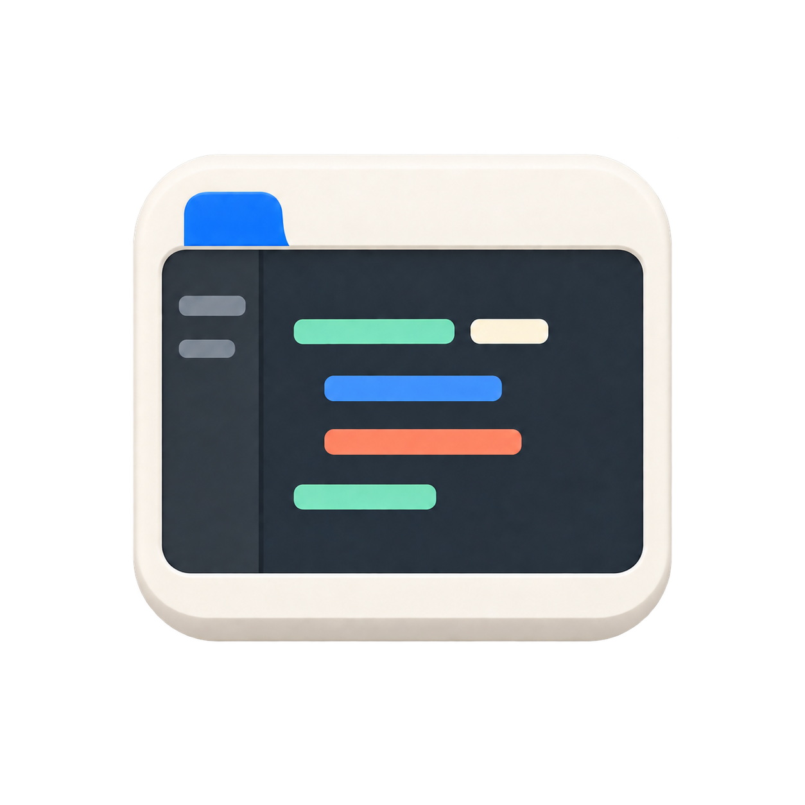

<p align="center">
  
</p>

# AdwCode —— 跟随 GNOME 的 VS Code 主题

跟随 GNOME 桌面的 Visual Studio Code 主题：调色板直接取自 **libadwaita 1.10**
（GNOME 51），语法高亮对齐 **GNOME Builder** 的 GtkSourceView 方案，界面采用固定蓝色强调色。

自有代码与资产采用可任选其一的双重许可，范围见 [许可声明](许可声明.md)；第三方组件与数据登记在
[文档/01-第三方许可证.md](文档/01-第三方许可证.md)，许可证声明见文末
[「许可证」](#许可证)。

## 特性

- **libadwaita 1.10 配色** —— 窗口 `#222226` / 视图 `#1d1d20` / 标题栏与侧栏
  `#2e2e32` / 弹出层 `#36363a`；浅色模式的半透明前景
  （`rgb(0 0 6 / 80%)`）按各自表面合成；15% `currentColor` 边框；
  7% / 12% 的悬停与激活填充。
- **界面颜色覆盖** —— 对照随附的 VS Code 颜色注册表与内置主题校验颜色键，
  覆盖聊天、智能体、笔记本、行内编辑、测试、合并编辑器与内联提示等界面。
  具体覆盖情况可运行 `meson compile -C builddir 校验` 查看。
- **GNOME Builder 语法高亮** —— 由随附的 GtkSourceView `Adwaita` /
  `Adwaita-dark` 方案生成，并附带 `semanticTokenColors` 语义高亮。
- **强调色** —— 固定使用 Adwaita 蓝色。
- **变体** —— 默认语法高亮（使用 VS Code 自带的 TextMate 规则）与
  彩色状态栏变体，以及高对比度主题。
- **产品图标主题** —— GNOME 风格的侧栏、调试、版本控制、补全与文件操作符号；
  窗口控制字形在 `window.controlsStyle` 为 `custom` 时生效。
- **GNOME 外观（CSS）** —— 为整个工作台带来 Adwaita 几何：9px 的按钮/输入框/
  编辑标签页、15px 的弹出层与快速输入、6px 的紧凑列表行与小控件、Adwaita 阴影、
  内缩细滚动条滑块。
- **推荐设置** —— 一条命令配置系统明暗主题、产品图标、GNOME 代码字体与
  Builder 风格布局，自动重载保持关闭。
- **终端配色** —— 由 GNOME 调色板推导的 16 色 ANSI。

## 主题

| 标签 | 说明 |
| --- | --- |
| `AdwCode 深色` / `AdwCode 浅色` | Builder 语法，标准状态栏 |
| `AdwCode 深色 · 彩色状态栏` / `AdwCode 浅色 · 彩色状态栏` | 状态栏填充强调色 |
| `AdwCode 深色 · 默认语法高亮` / `AdwCode 浅色 · 默认语法高亮` | 使用 VS Code 自带 TextMate 规则 |
| `AdwCode 深色 高对比度` / `AdwCode 浅色 高对比度` | libadwaita 高对比度参数 |

默认语法高亮变体只替换 TextMate 规则；界面配色和语义高亮仍沿用 AdwCode。

产品图标主题 `AdwCode` 覆盖 79 个图标标识，包含侧栏、布局、调试、版本控制、
补全和常用操作。四个窗口控制字形（`chrome-close`、`chrome-maximize`、
`chrome-minimize`、`chrome-restore`）只在
`window.controlsStyle` 设为 `custom` 时出现——推荐的 `native` 由 GNOME 绘制
按钮，这是推荐配置。未覆盖的图标保留 VS Code 默认 Codicons；来源、字形范围
和再生成方式见 [产品图标说明](产品图标/README.md)，逐项预览见
[产品图标陈列](文档/06-产品图标陈列.md)。

## 安装

**升级直接安装新 VSIX 即可，无需卸载旧版。**
自有接口在 3.0.0 中更名，不提供旧名称入口，详见
[中文接口迁移](文档/08-中文接口迁移.md#300-直接安装新-vsix)。

从 [Releases](https://github.com/KOTONEX/AdwCode/releases) 下载由 CI 自动构建的
`AdwCode-<版本>.vsix`，包含蓝色的 10 个主题变体。
把 `<版本>` 换成实际版本号，文件名以发布页附件为准，然后安装：

```sh
code --install-extension AdwCode-<版本>.vsix
```

也可以从源码构建（仓库中不包含 VSIX，构建产物会被 `.gitignore` 忽略；
`源码/打包扩展.py` 会打印生成的文件名）：

```sh
python3.14t 源码/生成主题.py            # 固定蓝色
python3.14t 源码/打包扩展.py          # 生成 AdwCode-<版本>.vsix
code --install-extension AdwCode-<版本>.vsix
```

## 设置

### 手动配置

```jsonc
"window.titleBarStyle": "custom",
"window.controlsStyle": "native",        // 由 GNOME 绘制窗口按钮
"window.commandCenter": true,           // 顶栏提供工作区搜索与命令入口
"window.autoDetectColorScheme": true,
"workbench.preferredDarkColorTheme": "AdwCode 深色",
"workbench.preferredLightColorTheme": "AdwCode 浅色 · 彩色状态栏",
"workbench.productIconTheme": "adwcode",
"editor.renderLineHighlight": "none",    // libadwaita 没有当前行边框
"workbench.tree.indent": 12,
"workbench.iconTheme": null,             // 本项目未提供文件图标主题
"editor.fontFamily": "Adwaita Mono"      // GNOME 48+ 自带
```

GNOME 扩展
[Rounded Window Corners](https://github.com/flexagoon/rounded-window-corners)
（原版已停止维护，这里使用社区维护的 fork）可对应 `--window-radius: 15px`。

### GNOME 外观（CSS）

颜色无法改变几何，因此 `附加外观/GNOME外观.css`（通过同一个 Custom CSS 加载器
生效）为工作台提供 Adwaita 形状：

- 定义 VS Code 1.140 引用却从未声明的设计令牌（`--vscode-cornerRadius-*`、
  `--vscode-spacing-*`、`--vscode-shadow-*`），一次性修正约 250 条规则
  （快速输入、建议列表、对话框、下拉框、通知、面板标题……）；
- 补充 AdwTabBar 风格的圆角标签页（9px）、内缩菜单项、圆角标题栏按钮、
  圆角列表行、9px 按钮/输入框、标题栏胶囊搜索框以及内缩细滚动条滑块；
- 统一侧栏、面板、通知与编辑器工具栏按钮，以及设置行、查找选项、复选框和
  对话框外观；键盘焦点环在容易裁切的区域使用内侧描边；
- 默认使用 `window.menuBarVisibility: compact` 折叠菜单，汉堡按钮保持
  VS Code 原生的活动栏位置；把设置改回 `classic` 或 `visible` 即可恢复完整菜单栏。

执行 **AdwCode: 安装 GNOME 外观（CSS）**（只想改窗口按钮则用
**AdwCode: 生成仅关闭按钮的窗口控件 CSS**）。完整安装包含三个 CSS 文件及
`窗口状态.js`：脚本将原生标题栏状态同步到导航容器，保留非活动窗口的弱化效果，
减少全工作台样式重算。检测到加载器时，安装命令将本次组件的已知源码和副本引用统一为单份安装副本，
保留其他加载项；状态面板会提示重复引用或重复注入。

开发时可在设置中开启
`adwcode.自动重载`：改动 `附加外观/*.css`、`附加外观/*.js`、`主题/*.json` 或扩展代码后，
会自动重新应用 Custom CSS 并重载窗口。VS Code 升级后补丁会被
覆盖：重新执行加载器的 **Reload Custom CSS and JS**，或再跑一次命令。

`python3.14t 源码/检查样式.py` 会校验 `附加外观/` 中每个类选择器在已安装的 VS Code 里
是否仍然存在（原生 JavaScript 类名在 bundle 中搜索，自有状态类核对附加脚本），以及样式引用的每个
`var(--vscode-*)` 是否都有定义——每次 VS Code 升级后都应运行。
未找到样式表时，校验会失败；可通过 `--样式表 /路径/workbench.desktop.main.css`
指定当前安装的构建。此检查不能替代实际界面验收。

### 一键应用设置

**AdwCode: 应用推荐设置** 先预览再写入用户设置：随系统切换普通与高对比度的
AdwCode 主题，采用 AdwCode 产品图标、GNOME 代码字体、原生窗口控件和 Builder
风格布局（关闭缩略图与面包屑、紧凑标签、12px 树缩进、平滑滚动等）。
默认开启命令中心，浅色采用彩色状态栏变体，深色采用普通变体；高对比度主题沿用原方案。
当前 VS Code 未提供的配置会在预览中列明并跳过。
命令用于日常外观，不写入 Python、ty、Meson 或格式化等项目开发配置。

推荐设置将用户级 `adwcode.自动重载` 设为关闭，也不会执行窗口重载。
标题栏等设置需要重新加载时，请保存工作并结束扩展会话后手动重载。
工作区可以覆盖用户设置，命令会提示仍然开启自动重载的情况；源码仓库默认在
工作区也关闭此项。如需在本仓库开启，应在工作区明确修改。
被覆盖的旧用户值会被记住，**AdwCode: 恢复推荐设置** 可逐项恢复，包括原有的
自动重载状态；恢复仍会覆盖应用推荐设置之后的手动修改。
工作区还提供 Python 自由线程、ty 与 AdwCode 预览配置，详见
[开发、验证与发布](文档/04-开发验证与发布.md#vs-code-工作区配置)。

升级到 2.0 后，主题名称与产品图标标识统一为 AdwCode。安装新版后，请重新选择
AdwCode 颜色主题与产品图标主题，或执行“AdwCode: 应用推荐设置”更新首选配置。
扩展不会自动改写已有的用户配置；手动保存的首选主题也需要更新名称。

### 外观安装状态

执行 **AdwCode: 查看外观安装状态**，可检查加载器是否安装、每个外观文件的
副本是否与源码一致、是否加入加载器配置，以及磁盘上的工作台 HTML 是否注入
当前版本。面板支持手动刷新，不会修改配置或重载窗口。

安装外观只合并用户级加载配置。若工作区覆盖了加载项，原覆盖保持不变，命令会提示
先在工作区中统一引用，再手动更新补丁；未安装加载器时复制的配置片段可直接粘贴。

磁盘补丁已更新不代表当前窗口已加载新样式。工作结束后再手动重载窗口，
避免中断当前工作。

### 仅保留关闭按钮

GNOME 默认布局只显示关闭按钮（`':close'`）：

```sh
gsettings get org.gnome.desktop.wm.preferences button-layout
```

- `"window.controlsStyle": "native"`（推荐）由 GTK 按该布局绘制，无需额外配置。
- VS Code 的自绘控件始终绘制最小化、最大化/还原与关闭三个按钮（固定 46px 宽、
  容器 138px），颜色主题与产品图标主题都无法隐藏。若要在自绘控件上保持 GNOME
  布局，执行 **AdwCode: 生成仅关闭按钮的窗口控件 CSS**：它会写入
  `~/.config/adwcode/仅关闭窗口控件.css`，并在检测到
  [Custom CSS and JS Loader](https://marketplace.visualstudio.com/items?itemName=be5invis.vscode-custom-css)
  时自动加入 `vscode_custom_css.imports`；否则把设置片段复制到剪贴板。先执行一次
  **Enable Custom CSS and JS**（该扩展需要 VS Code 安装目录的写权限）再重载窗口。

## 目录结构

```text
AdwCode/
├── AGENTS.md                    自动化代理（含 AI）说明
├── CONTRIBUTING.md              贡献指南
├── LICENSE                      AGPL-3.0 全文
├── meson.build                  统一命令入口
├── README.md                    本文件
├── package.json                 扩展清单，版本号唯一事实源
├── 源码/                         构建管线与可导入模块
│   ├── 生成主题.py                 生成主题并同步 package.json
│   ├── 检查样式.py             对照已安装的 VS Code 检查 附加外观/*.css
│   ├── 界面映射.py               VS Code 颜色键到 Adwaita 角色的映射
│   ├── 打包扩展.py               打包 VSIX
│   ├── 调色板.py               libadwaita 颜色角色与合成工具
│   ├── 生成变更日志.py         从 Git 标签与提交标题自动生成日志和发布说明
│   ├── 语法映射.py                GtkSourceView 样式名到 TextMate 作用域的映射
│   ├── 更新默认数据.py       刷新 VS Code 默认主题数据与键表
│   ├── GtkSourceView方案/       随附的 GtkSourceView 方案（LGPL-2.1+）
│   └── VSCode默认数据/         解析后的 VS Code 默认 token 颜色（MIT）与键表
├── 基准/                  按需性能基准与独立工作台验证
├── 测试/                       离线单元测试
│   └── test_主题.py          颜色运算、调色板、语法、主题、CSS
├── 主题/                      生成的主题 JSON（自动生成，请勿手工编辑；已提交）
├── 产品图标/               产品图标主题（Adwaita 符号字形与字体）
├── 附加外观/                      通过 Custom CSS 加载的样式表与窗口状态脚本
├── 扩展/                   命令、安装、状态面板与自动重载
├── 文档/                        深入文档与第三方许可证登记
└── .github/                     CI、发布工作流与议题 / PR 模板
```

## 环境要求

| 依赖 | 要求 | 用途 |
| --- | --- | --- |
| VS Code | ≥ 1.100（`package.json` 的 `engines`） | 运行主题与扩展 |
| Python | 3.9+（CI 与本地开发使用 3.14 自由线程版本） | 仅构建与打包需要 |
| Git | 完整项目历史与版本标签 | 自动生成变更日志及打包；使用预先生成日志的源码导出副本可不带 Git |
| Meson / Ninja | Meson ≥ 1.3 | 开发命令与 CI 调度；独立 Python 脚本可直接运行 |
| Ruff / ty / tsc / Node.js | 静态、格式、类型与扩展测试工具 | 完整开发验证需要，最终扩展无额外运行时库依赖 |
| VS Code 安装目录写权限 | — | Custom CSS and JS Loader 注入自定义 CSS 的要求 |

GNOME 系统跟随和扩展命令目前只在 Linux 上注册；颜色主题与产品图标可独立使用。
附加外观的已验证环境及限制见 [外观实现与验收](文档/05-外观实现与验收.md)。

## 故障排查

### VS Code 升级后 CSS 失效

升级会覆盖注入的自定义 CSS：重新执行 **AdwCode: 安装 GNOME 外观（CSS）**，
或让加载器执行 **Reload Custom CSS and JS**，随后运行
`python3.14t 源码/检查样式.py` 初筛类名与设计令牌，再检查实际界面的结构和外观。

### 自定义窗口控制图标不出现

四个窗口控制字形只在 `window.controlsStyle` 为 `custom` 时生效；推荐的 `native`
由 GNOME 绘制窗口按钮。侧栏、调试及其他产品图标仍由所选产品图标主题提供。

## 开发

项目说明按用途拆分：

- [自动化开发说明](AGENTS.md)：项目约定与智能体工作入口。
- [架构与实现状态](文档/03-架构与实现状态.md)：源数据、外观安装链路与功能边界。
- [开发、验证与发布](文档/04-开发验证与发布.md)：检查、手动预览和发布步骤。
- [贡献规范](CONTRIBUTING.md)：提交格式与贡献要求。
- [中文接口迁移](文档/08-中文接口迁移.md)：设置键、命令与脚本更名后的升级步骤。

需要 Python 3.9+（CI 与本地开发使用 3.14 自由线程版本）：

```sh
python3.14t 源码/生成主题.py --校验             # 产物注册、颜色格式、键覆盖与对比度
python3.14t 源码/检查样式.py                 # 自定义 CSS 与已安装 VS Code 的比对
python3.14t 源码/生成主题.py --监视             # 给主题加 _watch，编辑 JSON 即时生效
python3.14t 源码/更新默认数据.py           # 刷新 VS Code 默认主题数据与键表
python3.14t -m unittest discover -s 测试 -p 'test_*.py'   # 颜色运算、调色板、语法、主题、CSS
```

先安装 [uv](https://docs.astral.sh/uv/getting-started/installation/) 与 Node.js，
再安装自由线程 Python 和开发工具，完成首次配置与完整检查：

```sh
uv python install 3.14t
python3.14t -m pip install meson ninja ty ruff==0.16.9
npm install -g typescript          # 需先安装 Node.js
meson setup builddir
meson test -C builddir --print-errorlogs
```

生成主题使用 `meson compile -C builddir 主题`，打包使用
`meson compile -C builddir 打包`。Meson 不编译扩展 JavaScript；Python 脚本仍可
单独运行。其余目标与贡献流程见 [CONTRIBUTING.md](CONTRIBUTING.md)。

变更日志从 Git 提交标题和版本标签自动生成，无需维护手写文件。运行
`meson compile -C builddir 变更日志` 查看 `builddir/CHANGELOG.md`；打包时自动纳入
VSIX。当前版本的说明可通过 `meson compile -C builddir 发布说明` 预览。
未提交修改不进入日志；已发布记录见
[GitHub 发布页](https://github.com/KOTONEX/AdwCode/releases)，完整规则见
[自动变更日志](文档/04-开发验证与发布.md#自动变更日志)。

全部 Python 文件使用 Ruff 0.16.9 检查和格式化，含图标生成器与性能基准。
运行 `meson compile -C builddir 格式化` 应用格式化，`lint` 目标同时执行
`ruff check .`、`ruff format --check .`、ty、tsc 和 JavaScript 语法检查。
Ruff 不处理 JavaScript 或 CSS，相关验证分别由 tsc、Node.js 和 CSS 检查器提供。

`--check` 检查主题和产品图标的注册及文件完整性，要求界面、TextMate 和语义颜色
使用六位或八位十六进制写法。未知颜色键会导致失败，未覆盖的内置键会被列出；
对比度检查覆盖全部已生成主题；缺少随附的颜色键表时直接失败。

产品图标优先使用 Adwaita 官方字形，再由 GNOME Builder 补充调试、补全和
版本控制符号；MoreWaita 仅作为缺项的备用来源。布局状态对保留 Adwaita 派生字形。
来源、许可证和再生成命令见 [产品图标说明](产品图标/README.md)。
外观实施、两轮审查与安装验证步骤见 [外观实现与验收](文档/05-外观实现与验收.md)。


### 界面与代码字体

安装 GNOME 外观时，扩展读取 GNOME 的 `font-name`，生成 `GNOME字体.css`；
`adwcode.界面字体` 留空时使用系统字体，填写时只指定一个界面字体族。
找不到字体时依次回退到 Adwaita Sans、Cantarell 和系统无衬线字体。
直接加载源 CSS 时也使用这条回退链，字体大小仍由 VS Code 的界面缩放管理。

界面字体不改动编辑器或终端的字体。“应用推荐设置”单独读取 GNOME 的
`monospace-font-name` 设置代码字体；无法读取时回退到 Adwaita Mono、monospace。
更改系统字体或 `adwcode.界面字体` 后重新安装外观，待保存工作后手动加载。

## 许可证

自有代码采用 **AGPL-3.0-or-later 或木兰公共许可证第 2 版或其后续版本**，自有资产采用
**AGPL-3.0-or-later 或 CC BY-SA 4.0 或其后续版本**，使用者可任选其一。全文与具体范围见
[许可声明](许可声明.md)。第三方及其衍生内容保留原许可，登记在
[第三方许可证](文档/01-第三方许可证.md)。本项目与 GNOME 基金会无隶属关系。
