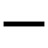
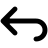
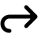
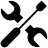
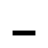
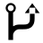
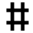

# 产品图标陈列

本文展示当前产品图标主题实际映射的全部字形，便于比较外观、查询用途和追踪来源。
当前共有 **79 个产品图标标识、68 个不同字形、3 个字体**。同一行中的多个标识
共用一个字形；未列出的标识由 VS Code 默认 Codicons 提供。文件类型图标属于另一套主题。

缩略图以当前字体的真实轮廓在白色背景上放大至 48 × 48 像素，包含字重调整，
方便浅色和深色 Markdown 预览阅读；未调整的布局字形使用原 SVG。
它们不是当前窗口截图，实际图标会跟随 VS Code 的颜色和尺寸。
点击缩略图可查看陈列轮廓，点击“原始 SVG”列可追溯未经修改的上游图标。

映射以 [adwaita.json](../product-icons/adwaita.json) 为准；上游版本、哈希和码点见
[sources.json](../product-icons/sources.json)。构建方法见 [产品图标说明](../product-icons/README.md)，
完整许可与分发边界见 [第三方许可证](01-第三方许可证.md)。

选材优先级固定为 **Adwaita → GNOME Builder → MoreWaita**。优先使用语义相符的
官方字形，再由 Builder 补充开发专用符号；当前 MoreWaita 仅作备用，未启用映射。

## 浏览索引

- [Adwaita：通用操作与窗口](#adwaita通用操作与窗口)：通用操作、项目与窗口按钮。
- [GNOME Builder：开发与补全](#gnome-builder开发与补全)：调试、版本控制、测试入口与语言符号。
- [布局状态对（Adwaita 派生）](#布局状态对adwaita-派生)：保留显示与隐藏状态的区别。
- [MoreWaita：备用来源](#morewaita备用来源)：尚未启用的补缺来源。

## Adwaita：通用操作与窗口

来源：Adwaita Icon Theme。字体：[adwaita-symbols.ttf](../product-icons/adwaita-symbols.ttf)。
共 37 个字形；这些图标及其缩略图保留 **LGPL-3.0-only** 许可。

窗口控制仅在 `window.controlsStyle` 为 `custom` 时使用；原生窗口按钮由桌面绘制。

| 预览 | 用途 | VS Code 产品图标标识 | 码点 | 原始 SVG |
| --- | --- | --- | --- | --- |
| [](../product-icons/rendered/adwcode-adwaita/e300.svg) | 文件浏览入口 | `files` | `U+E300` | [folder-documents-symbolic.svg](../product-icons/imported/adwaita/folder-documents-symbolic.svg) |
| [](../product-icons/rendered/adwcode-adwaita/e301.svg) | 搜索 | `search` | `U+E301` | [edit-find-symbolic.svg](../product-icons/imported/adwaita/edit-find-symbolic.svg) |
| [](../product-icons/rendered/adwcode-adwaita/e302.svg) | 设置 | `settings-gear` | `U+E302` | [emblem-system-symbolic.svg](../product-icons/imported/adwaita/emblem-system-symbolic.svg) |
| [](../product-icons/rendered/adwcode-adwaita/e303.svg) | 刷新 | `refresh` | `U+E303` | [view-refresh-symbolic.svg](../product-icons/imported/adwaita/view-refresh-symbolic.svg) |
| [](../product-icons/rendered/adwcode-adwaita/e304.svg) | 新增 | `add` | `U+E304` | [list-add-symbolic.svg](../product-icons/imported/adwaita/list-add-symbolic.svg) |
| [](../product-icons/rendered/adwcode-adwaita/e305.svg) | 移除 | `remove` | `U+E305` | [list-remove-symbolic.svg](../product-icons/imported/adwaita/list-remove-symbolic.svg) |
| [](../product-icons/rendered/adwcode-adwaita/e306.svg) | 关闭操作与窗口 | `close`、`chrome-close` | `U+E306` | [window-close-symbolic.svg](../product-icons/imported/adwaita/window-close-symbolic.svg) |
| [](../product-icons/rendered/adwcode-adwaita/e307.svg) | 新建文件 | `new-file`、`file-add` | `U+E307` | [document-new-symbolic.svg](../product-icons/imported/adwaita/document-new-symbolic.svg) |
| [](../product-icons/rendered/adwcode-adwaita/e308.svg) | 新建文件夹 | `new-folder` | `U+E308` | [folder-new-symbolic.svg](../product-icons/imported/adwaita/folder-new-symbolic.svg) |
| [](../product-icons/rendered/adwcode-adwaita/e309.svg) | 保存 | `save` | `U+E309` | [document-save-symbolic.svg](../product-icons/imported/adwaita/document-save-symbolic.svg) |
| [](../product-icons/rendered/adwcode-adwaita/e30a.svg) | 另存为 | `save-as` | `U+E30A` | [document-save-as-symbolic.svg](../product-icons/imported/adwaita/document-save-as-symbolic.svg) |
| [](../product-icons/rendered/adwcode-adwaita/e30b.svg) | 复制 | `copy` | `U+E30B` | [edit-copy-symbolic.svg](../product-icons/imported/adwaita/edit-copy-symbolic.svg) |
| [](../product-icons/rendered/adwcode-adwaita/e30c.svg) | 剪贴板 | `clippy` | `U+E30C` | [edit-paste-symbolic.svg](../product-icons/imported/adwaita/edit-paste-symbolic.svg) |
| [](../product-icons/rendered/adwcode-adwaita/e30d.svg) | 撤销或放弃变更 | `discard` | `U+E30D` | [edit-undo-symbolic.svg](../product-icons/imported/adwaita/edit-undo-symbolic.svg) |
| [](../product-icons/rendered/adwcode-adwaita/e30e.svg) | 重做 | `redo` | `U+E30E` | [edit-redo-symbolic.svg](../product-icons/imported/adwaita/edit-redo-symbolic.svg) |
| [](../product-icons/rendered/adwcode-adwaita/e30f.svg) | 删除 | `trash` | `U+E30F` | [user-trash-symbolic.svg](../product-icons/imported/adwaita/user-trash-symbolic.svg) |
| [](../product-icons/rendered/adwcode-adwaita/e310.svg) | 查找替换 | `replace` | `U+E310` | [edit-find-replace-symbolic.svg](../product-icons/imported/adwaita/edit-find-replace-symbolic.svg) |
| [](../product-icons/rendered/adwcode-adwaita/e311.svg) | 暂停调试 | `debug-pause` | `U+E311` | [media-playback-pause-symbolic.svg](../product-icons/imported/adwaita/media-playback-pause-symbolic.svg) |
| [](../product-icons/rendered/adwcode-adwaita/e312.svg) | 错误 | `error` | `U+E312` | [dialog-error-symbolic.svg](../product-icons/imported/adwaita/dialog-error-symbolic.svg) |
| [](../product-icons/rendered/adwcode-adwaita/e313.svg) | 警告 | `warning` | `U+E313` | [dialog-warning-symbolic.svg](../product-icons/imported/adwaita/dialog-warning-symbolic.svg) |
| [](../product-icons/rendered/adwcode-adwaita/e314.svg) | 信息提示 | `info` | `U+E314` | [dialog-information-symbolic.svg](../product-icons/imported/adwaita/dialog-information-symbolic.svg) |
| [](../product-icons/rendered/adwcode-adwaita/e315.svg) | 文件夹 | `folder` | `U+E315` | [folder-symbolic.svg](../product-icons/imported/adwaita/folder-symbolic.svg) |
| [](../product-icons/rendered/adwcode-adwaita/e316.svg) | 已打开的文件夹 | `folder-opened` | `U+E316` | [document-open-symbolic.svg](../product-icons/imported/adwaita/document-open-symbolic.svg) |
| [](../product-icons/rendered/adwcode-adwaita/e317.svg) | 向右或折叠 | `chevron-right` | `U+E317` | [pan-end-symbolic.svg](../product-icons/imported/adwaita/pan-end-symbolic.svg) |
| [](../product-icons/rendered/adwcode-adwaita/e318.svg) | 向下或展开 | `chevron-down` | `U+E318` | [pan-down-symbolic.svg](../product-icons/imported/adwaita/pan-down-symbolic.svg) |
| [](../product-icons/rendered/adwcode-adwaita/e319.svg) | 向上 | `chevron-up` | `U+E319` | [pan-up-symbolic.svg](../product-icons/imported/adwaita/pan-up-symbolic.svg) |
| [](../product-icons/rendered/adwcode-adwaita/e31a.svg) | 向左 | `chevron-left` | `U+E31A` | [pan-start-symbolic.svg](../product-icons/imported/adwaita/pan-start-symbolic.svg) |
| [](../product-icons/rendered/adwcode-adwaita/e31b.svg) | 终端 | `terminal` | `U+E31B` | [utilities-terminal-symbolic.svg](../product-icons/imported/adwaita/utilities-terminal-symbolic.svg) |
| [](../product-icons/rendered/adwcode-adwaita/e31c.svg) | 扩展 | `extensions` | `U+E31C` | [application-x-addon-symbolic.svg](../product-icons/imported/adwaita/application-x-addon-symbolic.svg) |
| [](../product-icons/rendered/adwcode-adwaita/e31d.svg) | 继续或启动运行 | `debug-continue`、`run`、`play`、`debug-start` | `U+E31D` | [media-playback-start-symbolic.svg](../product-icons/imported/adwaita/media-playback-start-symbolic.svg) |
| [](../product-icons/rendered/adwcode-adwaita/e31e.svg) | 停止运行 | `debug-stop`、`stop` | `U+E31E` | [media-playback-stop-symbolic.svg](../product-icons/imported/adwaita/media-playback-stop-symbolic.svg) |
| [](../product-icons/rendered/adwcode-adwaita/e31f.svg) | 包与包符号 | `package`、`symbol-package` | `U+E31F` | [package-x-generic-symbolic.svg](../product-icons/imported/adwaita/package-x-generic-symbolic.svg) |
| [](../product-icons/rendered/adwcode-adwaita/e320.svg) | 开发工具 | `tools` | `U+E320` | [preferences-system-symbolic.svg](../product-icons/imported/adwaita/preferences-system-symbolic.svg) |
| [](../product-icons/rendered/adwcode-adwaita/e321.svg) | 项目根目录 | `root-folder`、`root-folder-opened` | `U+E321` | [folder-projects-symbolic.svg](../product-icons/imported/adwaita/folder-projects-symbolic.svg) |
| [](../product-icons/rendered/adwcode-adwaita/e322.svg) | 最大化窗口 | `chrome-maximize` | `U+E322` | [window-maximize-symbolic.svg](../product-icons/imported/adwaita/window-maximize-symbolic.svg) |
| [](../product-icons/rendered/adwcode-adwaita/e323.svg) | 最小化窗口 | `chrome-minimize` | `U+E323` | [window-minimize-symbolic.svg](../product-icons/imported/adwaita/window-minimize-symbolic.svg) |
| [](../product-icons/rendered/adwcode-adwaita/e324.svg) | 还原窗口 | `chrome-restore` | `U+E324` | [window-restore-symbolic.svg](../product-icons/imported/adwaita/window-restore-symbolic.svg) |

## GNOME Builder：开发与补全

来源：GNOME Builder。字体：[builder-symbols.ttf](../product-icons/builder-symbols.ttf)。
共 25 个字形；这些图标及其缩略图保留 **CC-BY-SA-3.0** 许可。

| 预览 | 用途 | VS Code 产品图标标识 | 码点 | 原始 SVG |
| --- | --- | --- | --- | --- |
| [](../product-icons/rendered/adwcode-builder/e100.svg) | 运行与调试入口 | `debug-alt`、`debug`、`bug` | `U+E100` | [builder-debugger-symbolic.svg](../product-icons/imported/builder/builder-debugger-symbolic.svg) |
| [](../product-icons/rendered/adwcode-builder/e103.svg) | 版本控制与分支 | `source-control`、`git-branch` | `U+E103` | [builder-vcs-branch-symbolic.svg](../product-icons/imported/builder/builder-vcs-branch-symbolic.svg) |
| [](../product-icons/rendered/adwcode-builder/e104.svg) | 提交 | `git-commit` | `U+E104` | [commit-symbolic.svg](../product-icons/imported/builder/commit-symbolic.svg) |
| [](../product-icons/rendered/adwcode-builder/e105.svg) | 标签 | `tag` | `U+E105` | [builder-vcs-tag-symbolic.svg](../product-icons/imported/builder/builder-vcs-tag-symbolic.svg) |
| [](../product-icons/rendered/adwcode-builder/e109.svg) | 单步进入 | `debug-step-into` | `U+E109` | [debug-step-in-symbolic.svg](../product-icons/imported/builder/debug-step-in-symbolic.svg) |
| [](../product-icons/rendered/adwcode-builder/e10a.svg) | 单步跳出 | `debug-step-out` | `U+E10A` | [debug-step-out-symbolic.svg](../product-icons/imported/builder/debug-step-out-symbolic.svg) |
| [](../product-icons/rendered/adwcode-builder/e10b.svg) | 单步跳过 | `debug-step-over` | `U+E10B` | [debug-step-over-symbolic.svg](../product-icons/imported/builder/debug-step-over-symbolic.svg) |
| [](../product-icons/rendered/adwcode-builder/e10c.svg) | 断点 | `debug-breakpoint` | `U+E10C` | [debug-breakpoint-symbolic.svg](../product-icons/imported/builder/debug-breakpoint-symbolic.svg) |
| [](../product-icons/rendered/adwcode-builder/e10d.svg) | 新增变更 | `diff-added` | `U+E10D` | [builder-vcs-added-symbolic.svg](../product-icons/imported/builder/builder-vcs-added-symbolic.svg) |
| [](../product-icons/rendered/adwcode-builder/e10e.svg) | 修改变更 | `diff-modified` | `U+E10E` | [builder-vcs-changed-symbolic.svg](../product-icons/imported/builder/builder-vcs-changed-symbolic.svg) |
| [](../product-icons/rendered/adwcode-builder/e10f.svg) | 测试入口 | `beaker` | `U+E10F` | [builder-unit-tests-symbolic.svg](../product-icons/imported/builder/builder-unit-tests-symbolic.svg) |
| [](../product-icons/rendered/adwcode-builder/e110.svg) | 类 | `symbol-class` | `U+E110` | [lang-class-symbolic.svg](../product-icons/imported/builder/lang-class-symbolic.svg) |
| [](../product-icons/rendered/adwcode-builder/e111.svg) | 常量 | `symbol-constant` | `U+E111` | [lang-constant-symbolic.svg](../product-icons/imported/builder/lang-constant-symbolic.svg) |
| [](../product-icons/rendered/adwcode-builder/e112.svg) | 枚举 | `symbol-enum` | `U+E112` | [lang-enum-symbolic.svg](../product-icons/imported/builder/lang-enum-symbolic.svg) |
| [](../product-icons/rendered/adwcode-builder/e113.svg) | 枚举成员 | `symbol-enum-member` | `U+E113` | [lang-enum-value-symbolic.svg](../product-icons/imported/builder/lang-enum-value-symbolic.svg) |
| [](../product-icons/rendered/adwcode-builder/e114.svg) | 函数 | `symbol-function` | `U+E114` | [lang-function-symbolic.svg](../product-icons/imported/builder/lang-function-symbolic.svg) |
| [](../product-icons/rendered/adwcode-builder/e115.svg) | 方法 | `symbol-method` | `U+E115` | [lang-method-symbolic.svg](../product-icons/imported/builder/lang-method-symbolic.svg) |
| [](../product-icons/rendered/adwcode-builder/e116.svg) | 命名空间 | `symbol-namespace` | `U+E116` | [lang-namespace-symbolic.svg](../product-icons/imported/builder/lang-namespace-symbolic.svg) |
| [](../product-icons/rendered/adwcode-builder/e117.svg) | 字段 | `symbol-field` | `U+E117` | [lang-struct-field-symbolic.svg](../product-icons/imported/builder/lang-struct-field-symbolic.svg) |
| [](../product-icons/rendered/adwcode-builder/e118.svg) | 结构体 | `symbol-struct` | `U+E118` | [lang-struct-symbolic.svg](../product-icons/imported/builder/lang-struct-symbolic.svg) |
| [](../product-icons/rendered/adwcode-builder/e119.svg) | 变量 | `symbol-variable` | `U+E119` | [lang-variable-symbolic.svg](../product-icons/imported/builder/lang-variable-symbolic.svg) |
| [](../product-icons/rendered/adwcode-builder/e11a.svg) | 事件 | `symbol-event` | `U+E11A` | [lang-signal-symbolic.svg](../product-icons/imported/builder/lang-signal-symbolic.svg) |
| [](../product-icons/rendered/adwcode-builder/e11b.svg) | 代码片段 | `symbol-snippet` | `U+E11B` | [completion-snippet-symbolic.svg](../product-icons/imported/builder/completion-snippet-symbolic.svg) |
| [](../product-icons/rendered/adwcode-builder/e11c.svg) | 文本或单词 | `symbol-text` | `U+E11C` | [completion-word-symbolic.svg](../product-icons/imported/builder/completion-word-symbolic.svg) |
| [](../product-icons/rendered/adwcode-builder/e11d.svg) | 模块 | `symbol-module` | `U+E11D` | [lang-include-symbolic.svg](../product-icons/imported/builder/lang-include-symbolic.svg) |

## 布局状态对（Adwaita 派生）

来源：piousdeer/vscode-adwaita。字体：[adwaita-icons.ttf](../product-icons/adwaita-icons.ttf)。
共 6 个字形；这些图标及其缩略图保留 **GPL-3.0-only** 许可。

| 预览 | 用途 | VS Code 产品图标标识 | 码点 | 原始 SVG |
| --- | --- | --- | --- | --- |
| [](../product-icons/scalable/ea05.svg) | 显示左侧栏 | `layout-sidebar-left` | `U+EA05` | [ea05.svg](../product-icons/scalable/ea05.svg) |
| [](../product-icons/scalable/ea06.svg) | 隐藏左侧栏 | `layout-sidebar-left-off` | `U+EA06` | [ea06.svg](../product-icons/scalable/ea06.svg) |
| [](../product-icons/scalable/ea07.svg) | 显示底部面板 | `layout-panel` | `U+EA07` | [ea07.svg](../product-icons/scalable/ea07.svg) |
| [](../product-icons/scalable/ea08.svg) | 隐藏底部面板 | `layout-panel-off` | `U+EA08` | [ea08.svg](../product-icons/scalable/ea08.svg) |
| [](../product-icons/scalable/ea09.svg) | 显示右侧栏 | `layout-sidebar-right` | `U+EA09` | [ea09.svg](../product-icons/scalable/ea09.svg) |
| [](../product-icons/scalable/ea0a.svg) | 隐藏右侧栏 | `layout-sidebar-right-off` | `U+EA0A` | [ea0a.svg](../product-icons/scalable/ea0a.svg) |

## MoreWaita：备用来源

仅在 Adwaita 与 GNOME Builder 没有语义相符的字形时采用 MoreWaita。当前的包、
开发工具与项目目录已改用 Adwaita，MoreWaita 字体不再参与运行时加载，因此不列入
上面的实际使用字形表。原资产和来源记录仍保留，`sources.json` 中的
`enabled: false` 标记其备用状态。

## 使用与维护

选择“Adwaita”产品图标主题后，VS Code 使用上述映射。部分操作图标会复用字形，
例如运行与继续、项目目录的打开与关闭状态；断点的未验证、禁用等其他状态继续
保留默认图标，避免用同一符号抹去状态差异。备用自有字形没有被当前主题引用，
因此不列入本陈列。

修改产品图标映射时，同时更新本文的对应行和缩略图：

1. 从 `adwaita.json` 获取实际图标标识、字体和码点；从 `sources.json` 查找上游 SVG。
2. 用 `build_imported.py` 生成字体及 `rendered/` 轮廓，再以字形为单位生成
   缩略图；同一字形的别名不重复创建图片。例如：

   ```sh
   rsvg-convert --width 48 --height 48 --background-color white \
     --output docs/assets/product-icons/adwcode-adwaita/e31b.png \
     product-icons/rendered/adwcode-adwaita/e31b.svg
   ```

3. 按 Adwaita、GNOME Builder、MoreWaita 的顺序选材；无语义相符的图标时保留默认图标。
   核对陈列中的标识覆盖实际映射，删除不再引用的缩略图，并保留各来源的许可。
   缩略图目录按字体分开；它们沿用对应 SVG 的许可，不重新许可为 AGPL。
